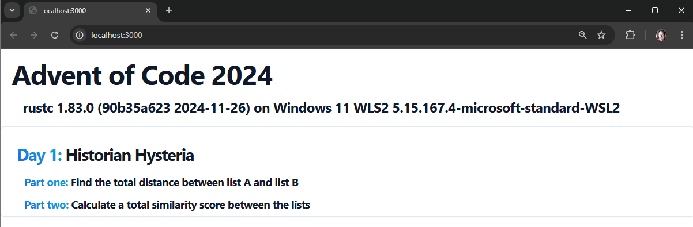
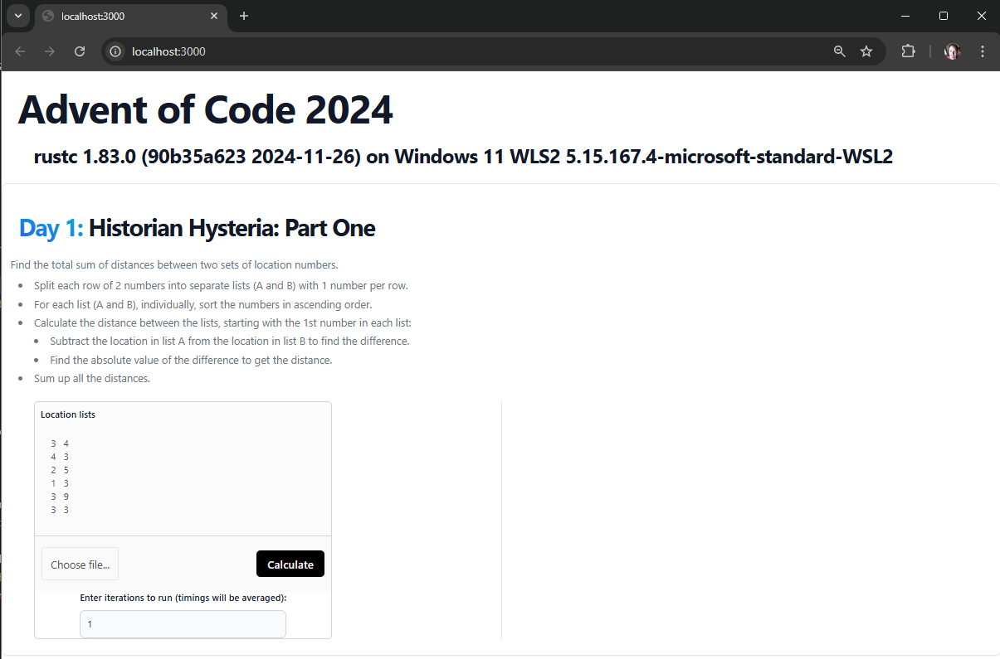
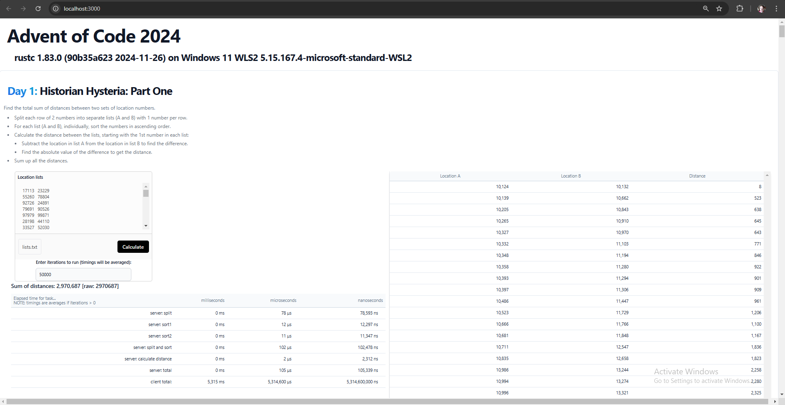
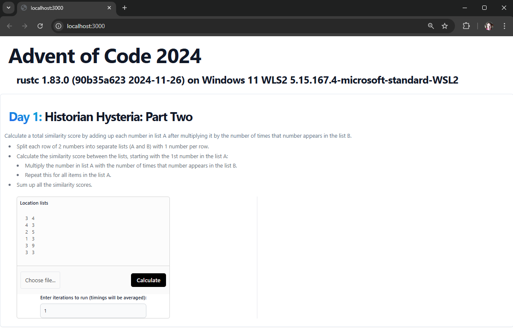
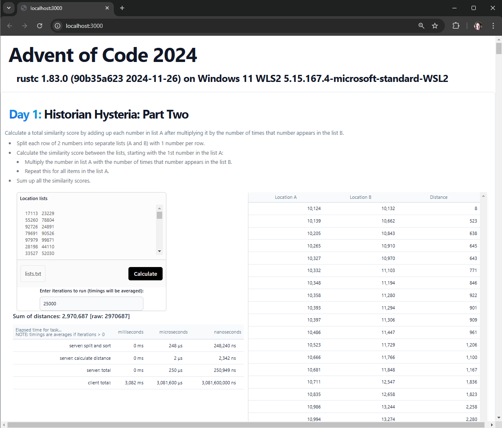
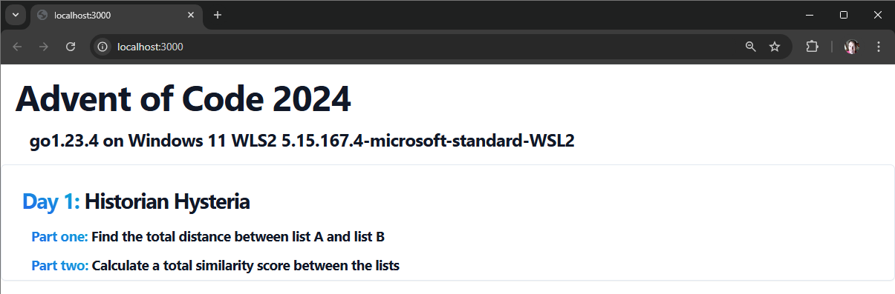
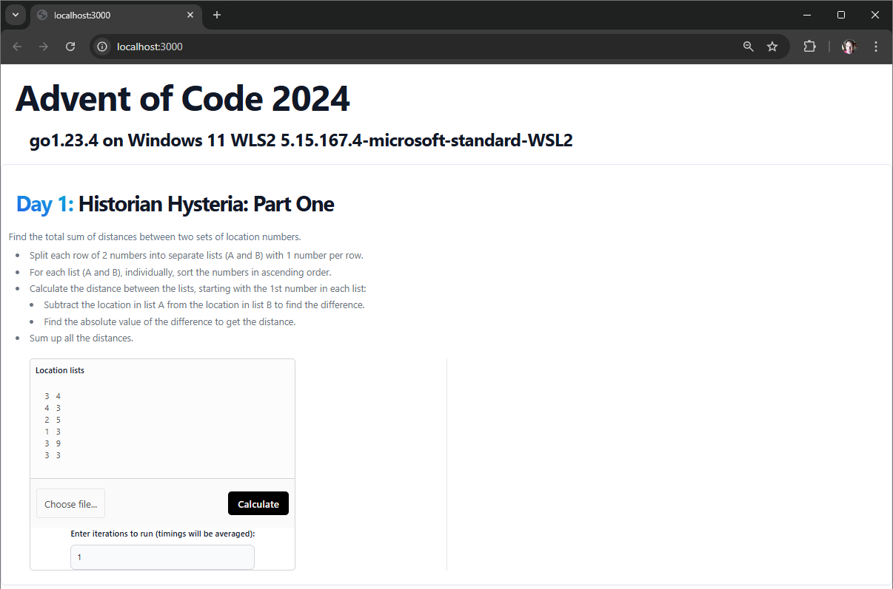
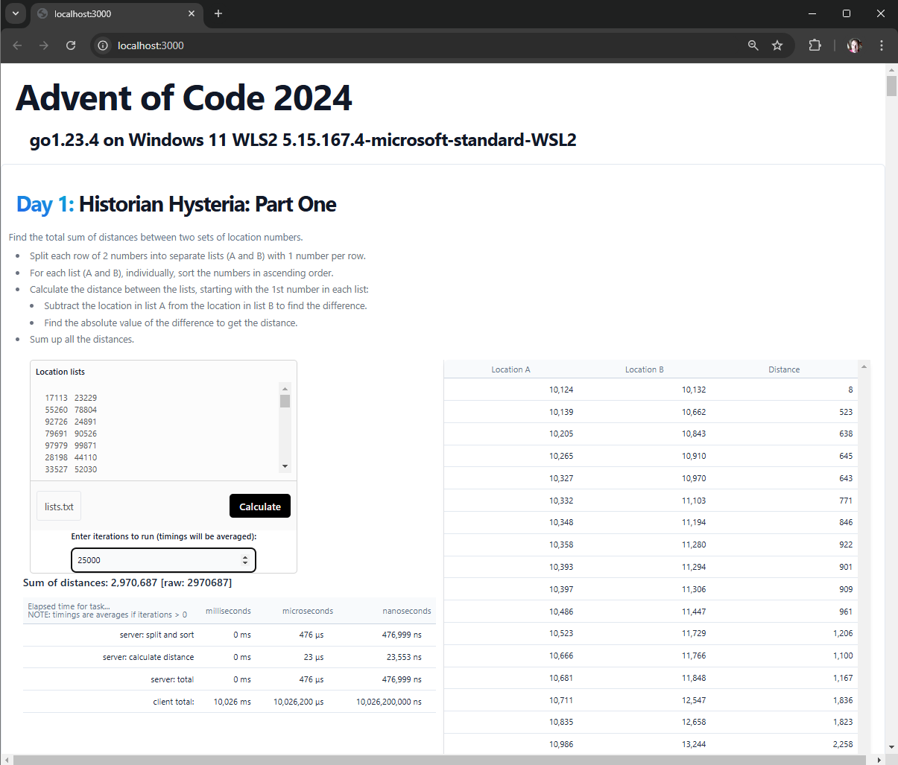
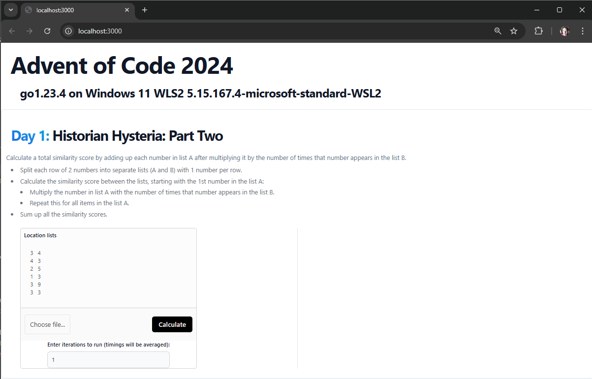
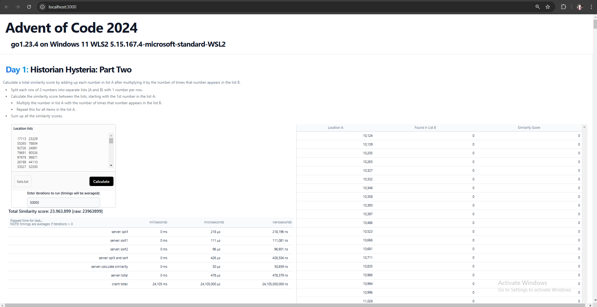

# Advent Of Code 2024

I'm working through the [Advent Of Code 2024](https://adventofcode.com/2024) challenges to compare the use of go-lang and rust for:
 * full-stack apps using:
    * [HTMX](https://htmx.org/)
    * [Alpine.js](https://alpinejs.dev/)
 * command-line apps
  * The command-line versions of the go and rust apps reports the elapsed time to compare the performance of each.

GitHub: https://github.com/rlyders/adventofcode2024

NOTE: This project was developed under Windows 11 WSL2, which is configured to use 50% of system memory. Thus, the following results from `free -h` reflect only half of the system RAM and these are typical results for my work on this project. I often run multiple instances of VS Code for this project to switch back and forth between rust and go-lang. 

```sh
$ free -h
               total        used        free      shared  buff/cache   available
Mem:           7.6Gi       6.0Gi       254Mi       3.1Mi       1.7Gi       1.7Gi
Swap:          2.0Gi       528Mi       1.5Gi
```

# rust version of app

For rust, I've completed Day 1 both Part One and Part Two both as a command-line app and as a full-stack web-app using [HTMX](https://htmx.org/) and [Alpine.js](https://alpinejs.dev/).

prerequisites: rust 1.83.0+

## HOW-TO Run rust full-stack web app

The following builds and runs the rust full-stack [HTMX](https://htmx.org/)/[Alpine.js](https://alpinejs.dev/) web app which allows the user to select one of the challenges from the Advent Of Code 2024 that I've already completed. As of this writing, the user can select from Day 1 Part One or Part two. More to come...

```sh
cd rust && ./build.sh && ./target/release/aoc24-web && cd -
```

Once running, open up http://localhost:3000 in your browser and you should see the following "Advent Of Code 2024" home page where you can select the challenge you want to run.



### Rust full-stack Day 1 Part One

If you click on Day 1 Part One challenge, you will be shown the following screen.


You can either enter in your list of numbers, click [Choose file...] to load the list of numbers from a file, or use the default list of numbers provided.

When ready, click [Calculate] to process the list of numbers shown.


### Rust full-stack Day 1 Part Two

If you click on Day 1 Part Two challenge, you will be shown the following screen.


You can either enter in your list of numbers, click [Choose file...] to load the list of numbers from a file, or use the default list of numbers provided.

When ready, click [Calculate] to process the list of numbers shown.


## HOW-TO Run rust command-line app

The rust command-line app executes the Advent Of Code challenges using the data file path passed as the 1st command-line argument. If no command-line argument is passed, then is uses the the first valid path from the following list: `./data`, `../data`

The following script runs the rust command-line app with the default data file repeatedly for 50,000 iterations.

```sh
./run.sh rust "" 50000
```

Sample output ** Running rust version under WSL2 Ubuntu on Windows 11 **:
```log
$ ./run.sh rust "" 50000
Valid runtime: rust
Directory exists: rust
prog=./target/release/aoc24

------------- Run with timing -------------
# [PID  60321] START: main       : RAM: 3.2 MB   (resident: 1.1 MB   share: 1.0 MB   code: 340.0 KB data: 368.0 KB)
# [PID  60321] START: Day1       : RAM: 3.2 MB   (resident: 1.1 MB   share: 1.0 MB   code: 340.0 KB data: 368.0 KB)
# [PID  60321] START: Day1 Part1 : RAM: 3.2 MB   (resident: 1.1 MB   share: 1.0 MB   code: 340.0 KB data: 368.0 KB)
Iterations: 50,000 ... all timings shown below are averages
------------------------------------------------------------------
      Total Distance:  2,970,687 [raw:    2970687]
-- Timings: --
                    split:  0 ms [     73 μs;         73 ns]
                    sort1:  0 ms [     10 μs;         10 ns]
                    sort2:  0 ms [      9 μs;          9 ns]
           split and sort:  0 ms [     93 μs;         93 ns]
       calculate distance:  0 ms [      1 μs;          1 ns]
                    total:  0 ms [     95 μs;         95 ns]
------------------------------------------------------------------
# [PID  60321] START: Day1 Part1 : RAM: 3.2 MB   (resident: 1.1 MB   share: 1.0 MB   code: 340.0 KB data: 368.0 KB)
# [PID  60321] START: Day1 Part2 : RAM: 3.2 MB   (resident: 1.1 MB   share: 1.0 MB   code: 340.0 KB data: 368.0 KB)
Iterations: 50,000 ... all timings shown below are averages
------------------------------------------------------------------
    Total Similarity: 23,963,899 [raw:   23963899]
-- Timings: --
                    split:  0 ms [     74 μs;         74 ns]
                    sort1:  0 ms [     10 μs;         10 ns]
                    sort2:  0 ms [     10 μs;         10 ns]
           split and sort:  0 ms [     95 μs;         95 ns]
     calculate similarity:  0 ms [      5 μs;          5 ns]
                    total:  0 ms [    103 μs;        103 ns]
------------------------------------------------------------------
# [PID  60321] END  : Day1 Part2 : RAM: 3.2 MB   (resident: 1.1 MB   share: 1.0 MB   code: 340.0 KB data: 368.0 KB)
# [PID  60321] END  : Day1       : RAM: 3.2 MB   (resident: 1.1 MB   share: 1.0 MB   code: 340.0 KB data: 368.0 KB)
# [PID  60321] END  : main       : RAM: 3.2 MB   (resident: 1.1 MB   share: 1.0 MB   code: 340.0 KB data: 368.0 KB)

real    0m9.894s
user    0m10.048s
sys     0m0.010s
run: OK
-------------------------------------------
```

Sample output ** Running rust version under Windows 11 via gitbash **:
```log
$ ./run.sh rust "" 50000
Valid runtime: rust
Directory exists: rust
prog=./target/release/aoc24

------------- Run with timing -------------
windows x86_64 Windows 11 (26100); 4 CPUs; 5.6 GB of 15.7 GB RAM
START: main: 6.3 MB of 13.6 MB RAM
START: Day1: 6.3 MB of 13.7 MB RAM
START: Day1 Part1: 6.7 MB of 13.8 MB RAM
Iterations: 50,000 ... all timings shown below are averages
------------------------------------------------------------------
      Total Distance:  2,970,687 [raw:    2970687]
-- Timings: --
                    split:  0 ms [     69 μs;         69 ns]
                    sort1:  0 ms [     10 μs;         10 ns]
                    sort2:  0 ms [      9 μs;          9 ns]
           split and sort:  0 ms [     89 μs;         89 ns]
       calculate distance:  0 ms [      2 μs;          2 ns]
                    total:  0 ms [     92 μs;         92 ns]
------------------------------------------------------------------
START: Day1 Part1: 6.8 MB of 13.9 MB RAM
START: Day1 Part2: 6.7 MB of 13.9 MB RAM
Iterations: 50,000 ... all timings shown below are averages
------------------------------------------------------------------
    Total Similarity: 23,963,899 [raw:   23963899]
-- Timings: --
                    split:  0 ms [     69 μs;         69 ns]
                    sort1:  0 ms [     10 μs;         10 ns]
                    sort2:  0 ms [     10 μs;         10 ns]
           split and sort:  0 ms [     90 μs;         90 ns]
     calculate similarity:  0 ms [      3 μs;          3 ns]
                    total:  0 ms [    101 μs;        101 ns]
------------------------------------------------------------------
END  : Day1 Part2: 6.9 MB of 14.0 MB RAM
END  : Day1: 7.5 MB of 14.6 MB RAM
END  : main: 7.7 MB of 14.7 MB RAM

real    0m10.108s
user    0m0.015s
sys     0m0.015s
run: OK
-------------------------------------------
```

Sample output ** Running rust version under MacOS on M4 Mini **:
```log
% ./run.sh rust "" 50000
Valid runtime: rust
Directory exists: rust
prog=./target/release/aoc24

------------- Run with timing -------------
rust v1.84.0 on MacOS 15.2 (Darwin 24.2.0) 10 CPUs 24.0 GB RAM (12.3 GB used)
Iterations: 50,000 ... all timings shown below are averages
------------------------------------------------------------------
      Total Distance:  2,970,687 [raw:    2970687]
-- Timings: --
                    split:  0 ms [     23 μs;         23 ns]
                    sort1:  0 ms [      4 μs;          4 ns]
                    sort2:  0 ms [      3 μs;          3 ns]
           split and sort:  0 ms [     31 μs;         31 ns]
       calculate distance:  0 ms [      0 μs;          0 ns]
                    total:  0 ms [     32 μs;         32 ns]
------------------------------------------------------------------
Iterations: 50,000 ... all timings shown below are averages
------------------------------------------------------------------
    Total Similarity: 23,963,899 [raw:   23963899]
-- Timings: --
                    split:  0 ms [     23 μs;         23 ns]
                    sort1:  0 ms [      4 μs;          4 ns]
                    sort2:  0 ms [      4 μs;          4 ns]
           split and sort:  0 ms [     32 μs;         32 ns]
     calculate similarity:  0 ms [      2 μs;          2 ns]
                    total:  0 ms [     32 μs;         32 ns]
------------------------------------------------------------------

real    0m3.347s
user    0m3.301s
sys     0m0.137s
run: OK
-------------------------------------------
```

# go-lang version of app

For go-lang, I've completed Day 1 both Parts One and Two both as a command-line app and as a full-stack web-app using [HTMX](https://htmx.org/) and [Alpine.js](https://alpinejs.dev/).

prerequisites: go 1.23.4+
s
NOTE: to run the go-lang app, be sure to run the `./go/create-links.sh` Linux shell script that creates symbolic links for the `elapsed` and `iterations` HTML templates in for day1 part1 and part2 directories. This avoids the need to duplicate those templates in both directories.

## HOW-TO Run go-lang command-line app

The go-lang command-line app executes the Advent Of Code challenges using the data file path passed as the 1st command-line argument. If no command-line argument is passed, then is uses the the first valid path from the following list: `./data`, `../data`

The following script runs the go-lang command-line app with the default data file repeatedly for 50,000 iterations.

```sh
./run.sh go "" 50000
```

Sample output ** Running go version under Windows 11 via gitbash **:

```log
$ ./run.sh go "" 50000
Valid runtime: go
Directory exists: go
prog=./app/cmd/bin/aoc24

------------- Run with timing -------------
windows: Microsoft Windows 11 Pro Intel(R) N100 15.7 MB GB RAM
# [PID 14248 ] START: main       : RAM: 306.2 KB of avail:   6.5 MB [GC cummulative: 306.2 KB, cycles:    0]
location lists file: ..\data\day1\lists.txt
# [PID 14248 ] START: Day1 Part1 : RAM: 307.6 KB of avail:   6.5 MB [GC cummulative: 307.6 KB, cycles:    0]
Iterations: 50,000 ... all timings shown below are averages
------------------------------------------------------------------
           Total Distance:  2,970,687 [raw:    2970687]
-- Timings: --
                    split:  0 ms [    139 μs;     139,966 ns]
                    sort1:  0 ms [     37 μs;      37,786 ns]
                    sort2:  0 ms [     34 μs;      34,333 ns]
           split and sort:  0 ms [    212 μs;     212,085 ns]
       calculate distance:  0 ms [      3 μs;       3,492 ns]
                    total:  0 ms [    216 μs;     216,586 ns]
------------------------------------------------------------------
# [PID 14248 ] END  : Day1 Part1 : RAM:   1.1 MB of avail:  15.3 MB [GC cummulative:   3.4 GB, cycles: 1020]
# [PID 14248 ] POST : GarbageCol : RAM: 175.4 KB of avail:  15.3 MB [GC cummulative:   3.4 GB, cycles: 1021]
# [PID 14248 ] START: Day1 Part2 : RAM: 176.8 KB of avail:  15.5 MB [GC cummulative:   3.4 GB, cycles: 1021]
Iterations: 50,000 ... all timings shown below are averages
------------------------------------------------------------------
         Total Similarity: 23,963,899 [raw:   23963899]
-- Timings: --
                    split:  0 ms [    144 μs;     144,874 ns]
                    sort1:  0 ms [     37 μs;      37,358 ns]
                    sort2:  0 ms [     37 μs;      37,859 ns]
           split and sort:  0 ms [    220 μs;     220,093 ns]
     calculate similarity:  0 ms [     35 μs;      35,796 ns]
                    total:  0 ms [    256 μs;     256,613 ns]
------------------------------------------------------------------
# [PID 14248 ] END  : Day1 Part2 : RAM:   1.0 MB of avail:  15.6 MB [GC cummulative:   7.5 GB, cycles: 2285]
# [PID 14248 ] END  : main       : RAM:   1.0 MB of avail:  15.6 MB [GC cummulative:   7.5 GB, cycles: 2285]
# [PID 14248 ] POST : GarbageCol : RAM: 179.8 KB of avail:  15.6 MB [GC cummulative:   7.5 GB, cycles: 2286]

real    0m23.976s
user    0m0.031s
sys     0m0.015s
run: OK
-------------------------------------------
```

Sample output ** Running go version under MacOS on M4 Mini **:
```log
% ./run.sh go "" 50000
Valid runtime: go
Directory exists: go
prog=./app/cmd/bin/aoc24

------------- Run with timing -------------
go1.23.4 on MacOS 15.2 (darwin 24.2.0) 10 CPUs (7% used), 11.8 GB RAM (24.0 GB used)

# [PID 57119 ] START: main       : RAM: 408.0 KB of avail:   6.6 MB [GC cummulative: 408.0 KB, cycles:    0]
location lists file: ../data/day1/lists.txt
# [PID 57119 ] START: Day1 Part1 : RAM: 408.7 KB of avail:   6.6 MB [GC cummulative: 408.7 KB, cycles:    0]
Iterations: 50,000 ... all timings shown below are averages
------------------------------------------------------------------
           Total Distance:  2,970,687 [raw:    2970687]
-- Timings: --
                    split:  0 ms [     51 μs;      51,189 ns]
                    sort1:  0 ms [      8 μs;       8,772 ns]
                    sort2:  0 ms [      7 μs;       7,923 ns]
           split and sort:  0 ms [     67 μs;      67,986 ns]
       calculate distance:  0 ms [      1 μs;       1,897 ns]
                    total:  0 ms [     70 μs;      70,176 ns]
------------------------------------------------------------------
# [PID 57119 ] END  : Day1 Part1 : RAM:   1.6 MB of avail:  11.5 MB [GC cummulative:   3.4 GB, cycles:  987]
# [PID 57119 ] POST : GarbageCol : RAM: 228.9 KB of avail:  11.5 MB [GC cummulative:   3.4 GB, cycles:  988]
# [PID 57119 ] START: Day1 Part2 : RAM: 230.4 KB of avail:  11.5 MB [GC cummulative:   3.4 GB, cycles:  988]
Iterations: 50,000 ... all timings shown below are averages
------------------------------------------------------------------
         Total Similarity: 23,963,899 [raw:   23963899]
-- Timings: --
                    split:  0 ms [     51 μs;      51,081 ns]
                    sort1:  0 ms [      8 μs;       8,682 ns]
                    sort2:  0 ms [      7 μs;       7,855 ns]
           split and sort:  0 ms [     67 μs;      67,722 ns]
     calculate similarity:  0 ms [     12 μs;      12,334 ns]
                    total:  0 ms [     80 μs;      80,270 ns]
------------------------------------------------------------------
# [PID 57119 ] END  : Day1 Part2 : RAM: 706.3 KB of avail:  11.5 MB [GC cummulative:   7.5 GB, cycles: 2190]
# [PID 57119 ] END  : main       : RAM: 706.6 KB of avail:  11.5 MB [GC cummulative:   7.5 GB, cycles: 2190]
# [PID 57119 ] POST : GarbageCol : RAM: 238.8 KB of avail:  11.5 MB [GC cummulative:   7.5 GB, cycles: 2191]

real    0m8.577s
user    0m7.650s
sys     0m0.218s
run: OK
-------------------------------------------
```

## HOW-TO Run go full-stack web app

The following builds and runs the go full-stack [HTMX](https://htmx.org/)/[Alpine.js](https://alpinejs.dev/) web app which allows the user to select one of the challenges from the Advent Of Code 2024 that I've already completed. As of this writing, the user can select from Day 1 Part One or Part two. More to come...

```sh
cd go && ./build.sh && go run app/web/main.go && cd -
```

Once running, open up http://localhost:3000 in your browser and you should see the following "Advent Of Code 2024" home page where you can select the challenge you want to run.



### Go full-stack Day 1 Part One

If you click on Day 1 Part One challenge, you will be shown the following screen.


You can either enter in your list of numbers, click [Choose file...] to load the list of numbers from a file, or use the default list of numbers provided.

When ready, click [Calculate] to process the list of numbers shown.


### Go full-stack Day 1 Part Two

If you click on Day 1 Part Two challenge, you will be shown the following screen.


You can either enter in your list of numbers, click [Choose file...] to load the list of numbers from a file, or use the default list of numbers provided.

When ready, click [Calculate] to process the list of numbers shown.


# TODOs

## TODO: add unit tests

