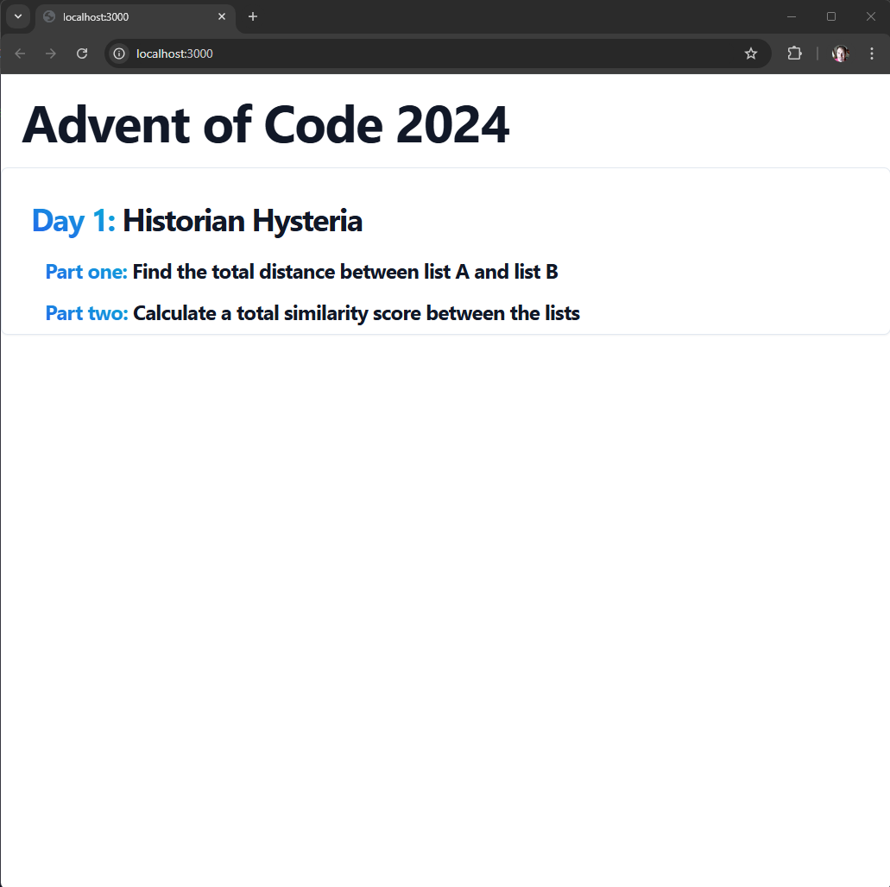
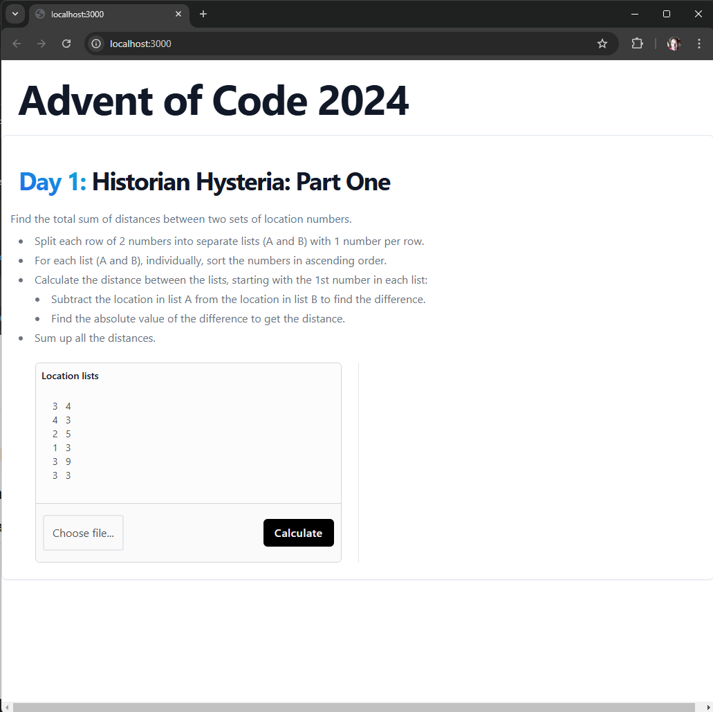
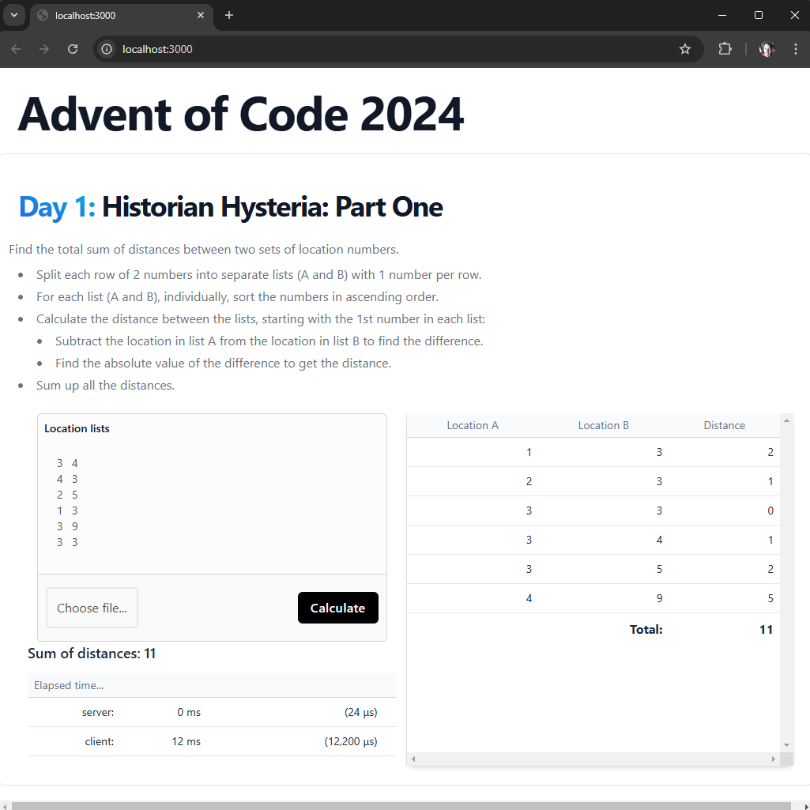
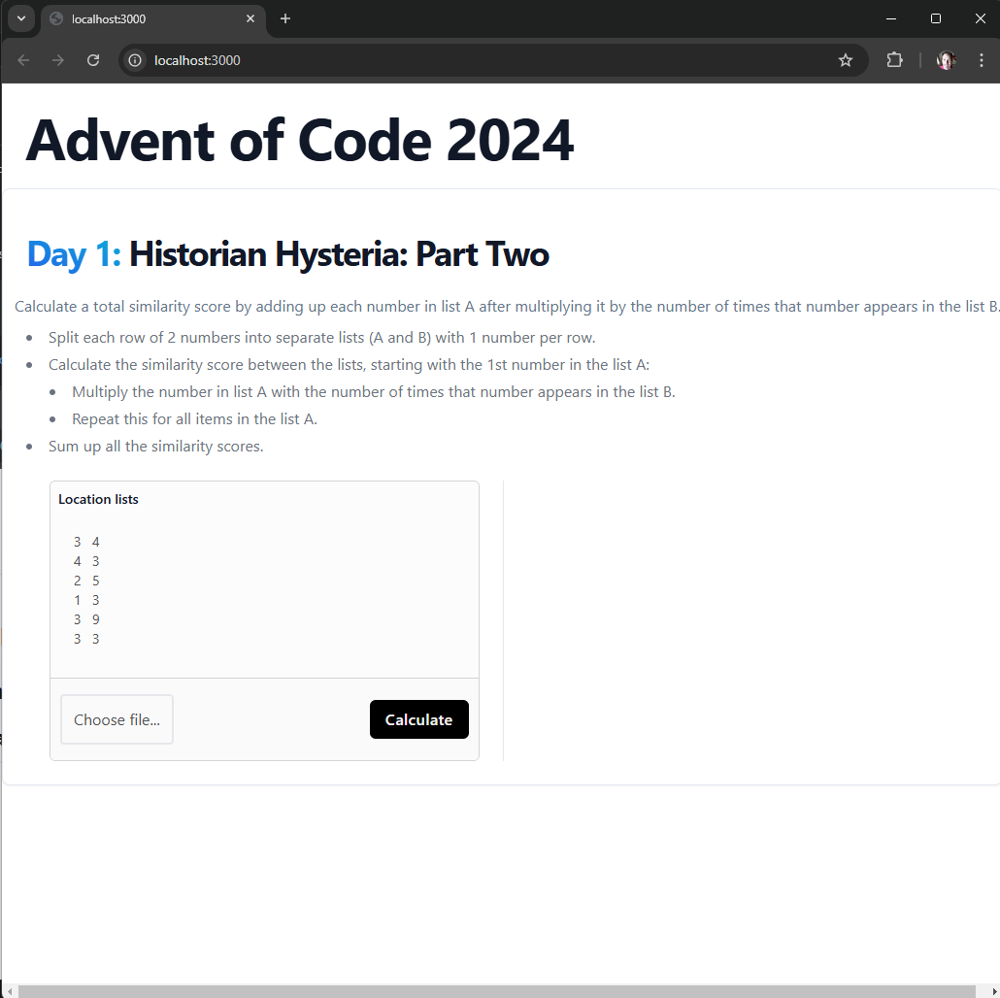
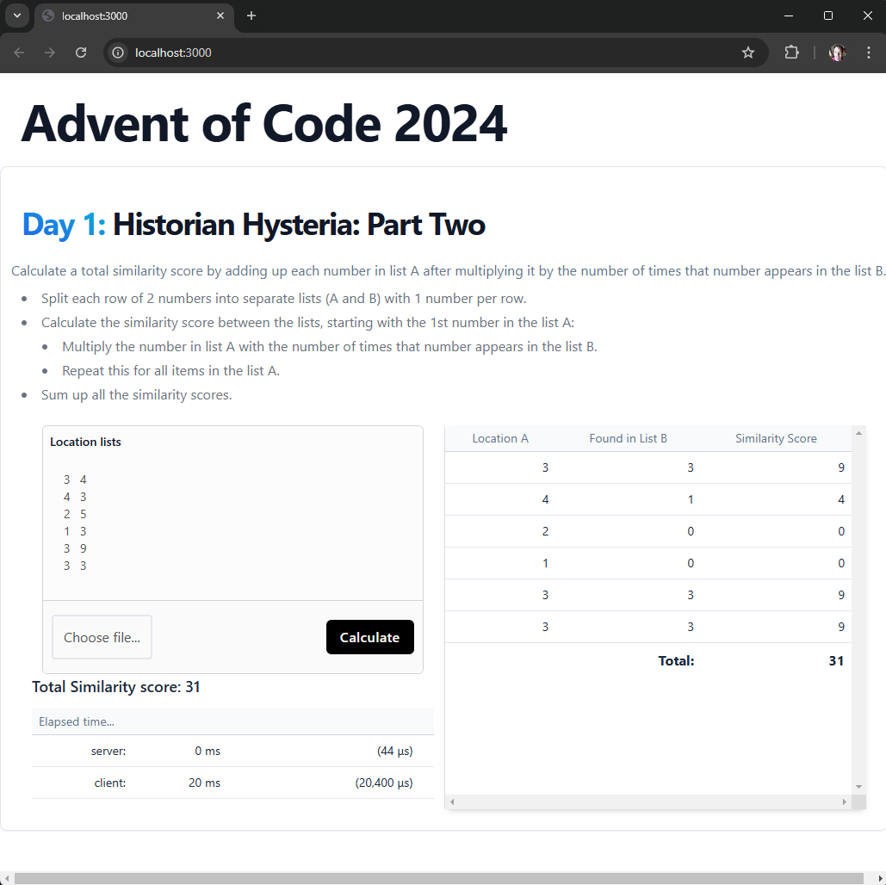

# Advent Of Code 2024

I'm working through the [Advent Of Code 2024](https://adventofcode.com/2024) challenges to compare the use of go-lang and rust for:
 * full-stack apps using:
    * [HTMX](https://htmx.org/)
    * [Alpine.js](https://alpinejs.dev/)
 * command-line apps
  * The command-line versions of the go and rust apps reports the elapsed time to compare the performance of each.

GitHub: https://github.com/rlyders/adventofcode2024

## rust

For rust, I've completed Day 1 both Part One and Part Two both as a command-line app and as a full-stack web-app using [HTMX](https://htmx.org/) and [Alpine.js](https://alpinejs.dev/).

prerequisites: rust 1.83.0

### HOW-TO Run rust full-stack web app

The following builds and runs the rust full-stack [HTMX](https://htmx.org/)/[Alpine.js](https://alpinejs.dev/) web app which allows the user to select one of the challenges from the Advent Of Code 2024 that I've already completed. As of this writing, the user can select from Day 1 Part One or Part two. More to come...

```sh
cargo run
```

Once running, open up http://localhost:3000 in your browser and you should see the following "Advent Of Code 2024" home page where you can select the challenge you want to run.



#### Rust full-stack Day 1 Part One

If you click on Day 1 Part One challenge, you will be shown the following screen.


You can either enter in your list of numbers, click [Choose file...] to load the list of numbers from a file, or use the default list of numbers provided.

When ready, click [Calculate] to process the list of numbers shown.


#### Rust full-stack Day 1 Part Two

If you click on Day 1 Part Two challenge, you will be shown the following screen.


You can either enter in your list of numbers, click [Choose file...] to load the list of numbers from a file, or use the default list of numbers provided.

When ready, click [Calculate] to process the list of numbers shown.


### HOW-TO Run rust command-line app

The following script builds and runs the rust command-line app which executes the Advent Of Code 2024 Day 1 Part One challenge using the data file: `./data/day1/lists.txt`

```sh
./run.sh rust
```

Sample output:
```log
Valid runtime: rust
Directory exists: rust
prog=./target/release/cmd
------------- Run tests -------------------
<<...warnings...>>
running 4 tests
test day1_part_one::tests::test_sum_differences ... ok
test day1_part_one::tests::test_parse_data ... ok
test day1_part_two::tests::test_parse_data ... ok
test day1_part_two::tests::test_sum_differences ... ok

test result: ok. 4 passed; 0 failed; 0 ignored; 0 measured; 0 filtered out; finished in 0.00s

     Running unittests src/cmd.rs (target/debug/deps/cmd-ea9d1cb42941d420)

running 2 tests
test day1_part_one::tests::test_sum_differences ... ok
test day1_part_one::tests::test_parse_data ... ok

test result: ok. 2 passed; 0 failed; 0 ignored; 0 measured; 0 filtered out; finished in 0.00s

tests: OK
-------------------------------------------

------------- Run buid --------------------
<<...warnings...>>
build: OK
-------------------------------------------
Build exists: ./target/release/cmd

------------- Build Results ---------------
-rwxr-xr-x 2 rjlyders rjlyders 438K Jan  6 01:52 ./target/release/cmd
Display build results: OK
-------------------------------------------

------------- Run with timing -------------
Sum of differences in x: 2970687

real	0m0.001s
user	0m0.000s
sys	0m0.001s
run: OK
-------------------------------------------
```

### HOW-TO Run go-lang command-line app

The go-lang app executes the Day 1 Part One challenge using the data file: `./data/day1/lists.txt`

```sh
./run.sh rust
```

## go-lang

I'm completed day 1 Part One in go. 

TODO: I plan to implement [HTMX](https://htmx.org/) and [Alpine.js](https://alpinejs.dev/) for go-lang as time allows.

### HOW-TO Run go-lang command-line app

The following script builds and runs the go-lang command-line app which executes the Advent Of Code 2024 Day 1 Part One challenge using the data file: `./data/day1/lists.txt`

```sh
./run.sh go
```

Sample output:

```log
rjlyders@lyders-limyee:~/work/adventofcode2024$ ./run.sh go
Valid runtime: go
Directory exists: go
prog=./bin/adventofcode
------------- Run tests -------------------
?       github.com/rlyders/adventofcode [no test files]
=== RUN   Test_getSumOfDistancesOfListsText
=== RUN   Test_getSumOfDistancesOfListsText/#00
distance: 11
--- PASS: Test_getSumOfDistancesOfListsText (0.00s)
    --- PASS: Test_getSumOfDistancesOfListsText/#00 (0.00s)
PASS
ok      github.com/rlyders/adventofcode/day1    (cached)
tests: OK
-------------------------------------------

------------- Run buid --------------------
build: OK
-------------------------------------------
Build exists: ./bin/adventofcode

------------- Build Results ---------------
-rwxr-xr-x 1 rjlyders rjlyders 1.5M Jan  6 01:02 ./bin/adventofcode
Display build results: OK
-------------------------------------------

------------- Run with timing -------------
distance: 2970687

real    0m0.002s
user    0m0.002s
sys     0m0.000s
run: OK
-------------------------------------------
```
