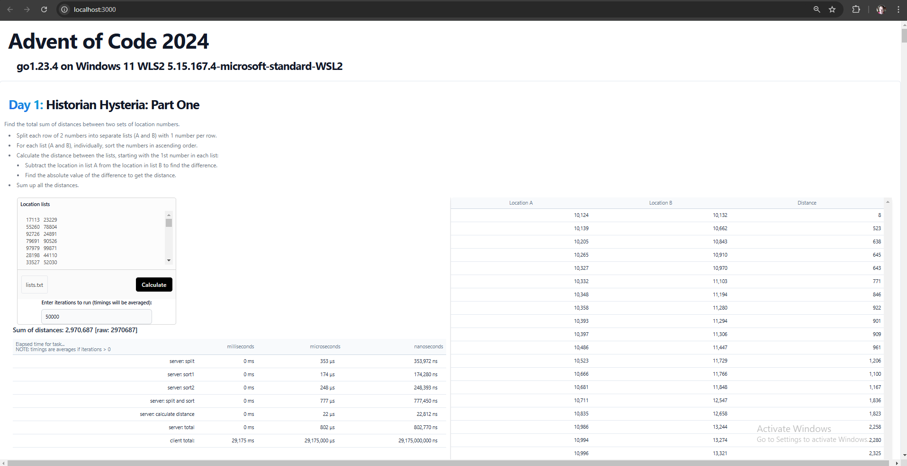

# Advent Of Code 2024

I'm working through the [Advent Of Code 2024](https://adventofcode.com/2024) challenges to compare the use of go-lang and rust for:
 * full-stack apps using:
    * [HTMX](https://htmx.org/)
    * [Alpine.js](https://alpinejs.dev/)
 * command-line apps
  * The command-line versions of the go and rust apps reports the elapsed time to compare the performance of each.

GitHub: https://github.com/rlyders/adventofcode2024

NOTE: This project was developed under Windows 11 WSL2, which is configured to use 50% of system memory. Thus, the following results from `free -h` reflect only half of the system RAM and these are typical results for my work on this project. I often run multiple instances of VS Code for this project to switch back and forth between rust and go-lang. 

```sh
$ free -h
               total        used        free      shared  buff/cache   available
Mem:           7.6Gi       6.0Gi       254Mi       3.1Mi       1.7Gi       1.7Gi
Swap:          2.0Gi       528Mi       1.5Gi
```

# rust version of app

For rust, I've completed Day 1 both Part One and Part Two both as a command-line app and as a full-stack web-app using [HTMX](https://htmx.org/) and [Alpine.js](https://alpinejs.dev/).

prerequisites: rust 1.83.0+

## HOW-TO Run rust full-stack web app

The following builds and runs the rust full-stack [HTMX](https://htmx.org/)/[Alpine.js](https://alpinejs.dev/) web app which allows the user to select one of the challenges from the Advent Of Code 2024 that I've already completed. As of this writing, the user can select from Day 1 Part One or Part two. More to come...

```sh
cd rust && ./build.sh && ./target/release/aoc24-web && cd -
```

Once running, open up http://localhost:3000 in your browser and you should see the following "Advent Of Code 2024" home page where you can select the challenge you want to run.


### Rust full-stack Day 1 Part One

If you click on Day 1 Part One challenge, you will be shown the following screen.


You can either enter in your list of numbers, click [Choose file...] to load the list of numbers from a file, or use the default list of numbers provided.

When ready, click [Calculate] to process the list of numbers shown.


### Rust full-stack Day 1 Part Two

If you click on Day 1 Part Two challenge, you will be shown the following screen.


You can either enter in your list of numbers, click [Choose file...] to load the list of numbers from a file, or use the default list of numbers provided.

When ready, click [Calculate] to process the list of numbers shown.


## HOW-TO Run rust command-line app

The rust command-line app executes the Advent Of Code challenges using the data file path passed as the 1st command-line argument. If no command-line argument is passed, then is uses the the first valid path from the following list: `./data`, `../data`

The following script runs the rust command-line app with the default data file repeatedly for 50,000 iterations.

```sh
./run.sh rust "" 50000
```

Sample output:
```log
$ ./run.sh rust "" 50000
Valid runtime: rust
Directory exists: rust
prog=./target/release/aoc24

------------- Run with timing -------------
Iterations: 50000 ... all timings shown below are averages
------------------------------------------------------------------
      Total Distance:  2,970,687 [raw:    2970687]
-- Timings: --
                    split:  0 ms [     70 μs;     70,580 ns]
                    sort1:  0 ms [     10 μs;     10,244 ns]
                    sort2:  0 ms [      9 μs;      9,849 ns]
           split and sort:  0 ms [     90 μs;     90,876 ns]
       calculate distance:  0 ms [      1 μs;      1,993 ns]
                    total:  0 ms [     93 μs;     93,258 ns]
------------------------------------------------------------------
Iterations: 50000 ... all timings shown below are averages
------------------------------------------------------------------
    Total Similarity: 23,963,899 [raw:   23963899]
-- Timings: --
                    split:  0 ms [     72 μs;     72,219 ns]
                    sort1:  0 ms [     10 μs;     10,791 ns]
                    sort2:  0 ms [     10 μs;     10,272 ns]
           split and sort:  0 ms [     93 μs;     93,485 ns]
     calculate similarity:  0 ms [      6 μs;      6,276 ns]
                    total:  0 ms [    106 μs;    106,720 ns]
------------------------------------------------------------------

real    0m9.679s
user    0m9.679s
sys     0m0.000s
run: OK
-------------------------------------------
```

# go-lang version of app

For go-lang, I've completed Day 1 both Parts One and Two both as a command-line app and as a full-stack web-app using [HTMX](https://htmx.org/) and [Alpine.js](https://alpinejs.dev/).

prerequisites: go 1.23.4+
s
NOTE: to run the go-lang app, be sure to run the `./go/create-links.sh` Linux shell script that creates symbolic links for the `elapsed` and `iterations` HTML templates in for day1 part1 and part2 directories. This avoids the need to duplicate those templates in both directories.

## HOW-TO Run go-lang command-line app

The go-lang command-line app executes the Advent Of Code challenges using the data file path passed as the 1st command-line argument. If no command-line argument is passed, then is uses the the first valid path from the following list: `./data`, `../data`

The following script runs the go-lang command-line app with the default data file repeatedly for 50,000 iterations.

```sh
./run.sh go "" 50000
```

Sample output:

```log
$ ./run.sh go "" 50000
Valid runtime: go
Directory exists: go
prog=./app/cmd/bin/aoc24

------------- Run with timing -------------
location lists file: ../data/day1/lists.txt
Iterations: 50000 ... all timings shown below are averages
------------------------------------------------------------------
           Total Distance:  2,970,687 [raw:    2970687]
-- Timings: --
                    split:  0 ms [    122 μs;     122,421 ns]
                    sort1:  0 ms [     92 μs;      92,305 ns]
                    sort2:  0 ms [     69 μs;      69,879 ns]
           split and sort:  0 ms [    284 μs;     284,865 ns]
       calculate distance:  0 ms [      9 μs;       9,321 ns]
                    total:  0 ms [    294 μs;     294,958 ns]
------------------------------------------------------------------
Iterations: 50000 ... all timings shown below are averages
------------------------------------------------------------------
         Total Similarity: 23,963,899 [raw:   23963899]
-- Timings: --
                    split:  0 ms [    145 μs;     145,288 ns]
                    sort1:  0 ms [     86 μs;      86,922 ns]
                    sort2:  0 ms [     76 μs;      76,334 ns]
           split and sort:  0 ms [    308 μs;     308,765 ns]
     calculate similarity:  0 ms [     37 μs;      37,587 ns]
                    total:  0 ms [    347 μs;     347,020 ns]
------------------------------------------------------------------

real    0m35.688s
user    0m35.584s
sys     0m2.609s
run: OK
-------------------------------------------
```

## HOW-TO Run go full-stack web app

The following builds and runs the go full-stack [HTMX](https://htmx.org/)/[Alpine.js](https://alpinejs.dev/) web app which allows the user to select one of the challenges from the Advent Of Code 2024 that I've already completed. As of this writing, the user can select from Day 1 Part One or Part two. More to come...

```sh
cd go && ./build.sh && go run app/web/main.go && cd -
```

Once running, open up http://localhost:3000 in your browser and you should see the following "Advent Of Code 2024" home page where you can select the challenge you want to run.


### Go full-stack Day 1 Part One

If you click on Day 1 Part One challenge, you will be shown the following screen.


You can either enter in your list of numbers, click [Choose file...] to load the list of numbers from a file, or use the default list of numbers provided.

When ready, click [Calculate] to process the list of numbers shown.


### Go full-stack Day 1 Part Two

If you click on Day 1 Part Two challenge, you will be shown the following screen.


You can either enter in your list of numbers, click [Choose file...] to load the list of numbers from a file, or use the default list of numbers provided.

When ready, click [Calculate] to process the list of numbers shown.


# TODOs

## TODO: add unit tests

